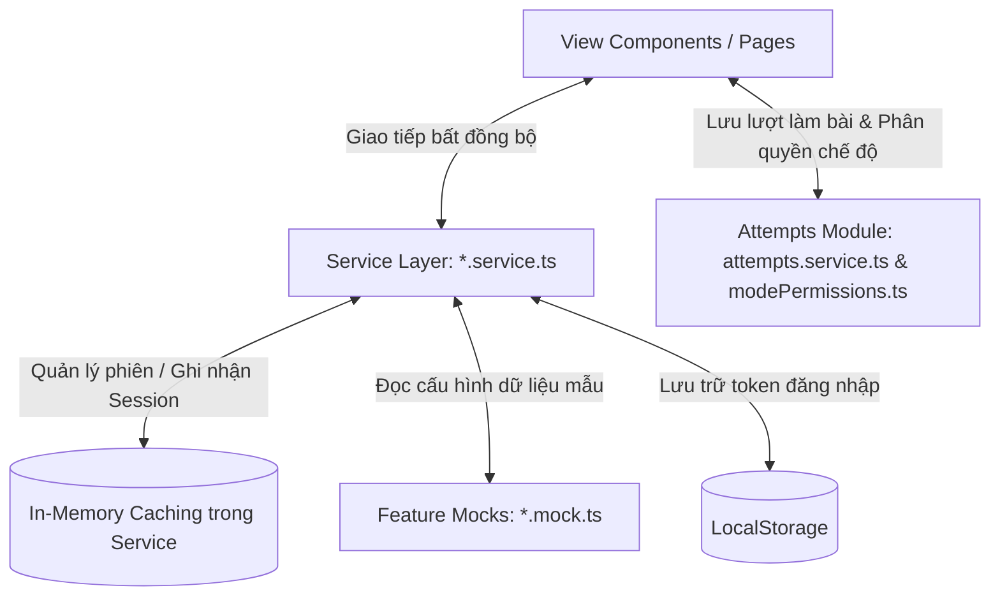
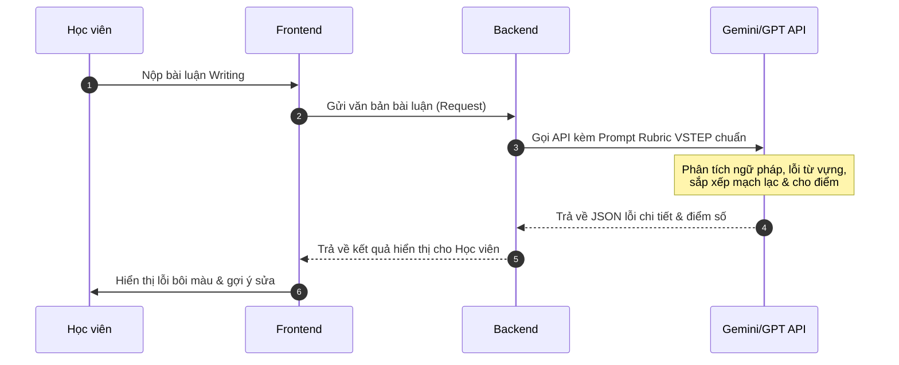

# BÁO CÁO PHÂN TÍCH TOÀN DIỆN DỰ ÁN VSTEPPro

Dự án **VSTEPPro** là một nền tảng luyện thi trực tuyến chuyên biệt cho kỳ thi VSTEP (Vietnamese Standardized Test of English Proficiency). Dưới đây là phân tích chi tiết về kiến trúc dự án, kiến trúc hệ thống, các luồng nghiệp vụ, danh sách toàn bộ các Use Cases (UC) và đề xuất cải tiến phát triển tiếp theo.

---

## 1. Tổng quan & Kiến trúc Dự án (Project Architecture)

Dự án được xây dựng dưới dạng **Single Page Application (SPA)** sử dụng React và TypeScript, quản lý build bởi Vite và chạy môi trường styling thông qua Tailwind CSS kết hợp thư viện thành phần shadcn/ui.

### 1.1. Sơ đồ Cấu trúc Thư mục (Directory Structure)

```
vstep-pathfinder-hub/
├── src/
│   ├── assets/             # Chứa tài nguyên tĩnh như logo, ảnh minh họa
│   ├── components/         # Các component UI tái sử dụng toàn cục
│   │   └── ui/             # Thư viện shadcn/ui (Button, Dialog, Card, Progress,...)
│   ├── features/           # Kiến trúc Feature-based chia nhỏ module
│   │   ├── auth/           # Module Đăng nhập / Đăng ký
│   │   │   ├── hooks/useAuth.tsx       # Quản lý phiên và auth state
│   │   │   ├── pages/Auth.tsx          # Trang đăng nhập/đăng ký
│   │   │   ├── services/auth.service.ts # Service quản lý accounts & session async
│   │   │   └── mocks/auth.mock.ts      # Dữ liệu tài khoản tĩnh
│   │   ├── dashboard/      # Module Trang cá nhân học viên
│   │   │   ├── pages/Dashboard.tsx
│   │   │   ├── services/dashboard.service.ts
│   │   │   └── mocks/dashboard.mock.ts
│   │   ├── admin/          # Module quản trị viên (CRUD)
│   │   │   ├── pages/Admin.tsx
│   │   │   ├── services/admin.service.ts
│   │   │   └── mocks/admin.mock.ts
│   │   ├── registration/   # Module Tra cứu/Đăng ký lịch thi VSTEP
│   │   │   ├── pages/VstepRegistration.tsx
│   │   │   ├── services/registration.service.ts
│   │   │   └── mocks/registration.mock.ts
│   │   ├── landing/        # Module Landing Page
│   │   │   ├── components/  # BenefitsSection, TestimonialSection, PricingSection
│   │   │   ├── pages/Index.tsx
│   │   │   ├── services/landing.service.ts
│   │   │   └── mocks/landing.mock.ts
│   │   ├── attempts/       # Module quản lý lượt thi & chế độ thi (Luyện tập / Thi thử) [NEW]
│   │   │   ├── types.ts                # Định nghĩa kiểu dữ liệu lượt thi, câu trả lời, review
│   │   │   ├── config/modePermissions.ts # Cấu hình phân quyền tính năng theo chế độ
│   │   │   ├── mocks/attempts.mock.ts  # Mock dữ liệu lượt thi & lịch sử
│   │   │   ├── services/attempts.service.ts # Service xử lý nộp bài, lưu trữ và lấy review
│   │   │   ├── components/
│   │   │   │   ├── MockTestTransition.tsx # Màn hình đếm ngược chuyển tiếp giữa các kỹ năng
│   │   │   │   ├── ModeSelector.tsx       # Lựa chọn chế độ Luyện tập / Thi thử tại Quiz Landing
│   │   │   │   └── review/                # Component review chi tiết theo kỹ năng
│   │   │   │       ├── ListeningReview.tsx
│   │   │   │       ├── ReadingReview.tsx
│   │   │   │       ├── WritingReview.tsx
│   │   │   │       └── SpeakingReview.tsx
│   │   │   └── pages/
│   │   │       ├── MockTestLanding.tsx    # Trang giới thiệu trước khi thi thử (full 4 kỹ năng)
│   │   │       └── AttemptReview.tsx      # Trang hiển thị kết quả & review chi tiết bài thi
│   │   └── quiz/           # Module Luyện thi thử VSTEP
│   │       ├── pages/Quiz.tsx
│   │       ├── pages/Results.tsx       # Trang tổng hợp kết quả
│   │       ├── services/quiz.service.ts
│   │       ├── mocks/quiz.mock.ts
│   │       ├── listening/              # Kỹ năng Nghe (Listening)
│   │       │   ├── pages/ListeningQuiz.tsx
│   │       │   ├── services/listening.service.ts
│   │       │   └── mocks/listening.mock.ts
│   │       ├── reading/                # Kỹ năng Đọc (Reading)
│   │       │   ├── pages/ReadingQuiz.tsx
│   │       │   ├── services/reading.service.ts
│   │       │   └── mocks/reading.mock.ts
│   │       ├── writing/                # Kỹ năng Viết (Writing)
│   │       │   ├── components/AnnotatedText.tsx
│   │       │   ├── pages/WritingQuiz.tsx
│   │       │   ├── pages/WritingSamples.tsx
│   │       │   ├── services/writing.service.ts
│   │       │   └── mocks/writing.mock.ts
│   │       └── speaking/               # Kỹ năng Nói (Speaking)
│   │           ├── pages/SpeakingQuiz.tsx
│   │           ├── services/speaking.service.ts
│   │           └── mocks/speaking.mock.ts
│   ├── hooks/              # Custom Hooks chung (use-toast,...)
│   ├── lib/
│   │   └── utils.ts        # Helper ghép class CSS (clsx + tailwind-merge)
│   ├── pages/
│   │   └── NotFound.tsx    # Trang báo lỗi 404
│   ├── App.tsx             # Định nghĩa tuyến đường (Routes)
│   ├── main.tsx            # Điểm khởi chạy (Entry Point)
│   └── index.css           # Cấu hình Token Design (Colors, Gradients, Fonts)
├── package.json            # Quản lý dependencies & scripts
└── tailwind.config.ts      # Cấu hình TailwindCSS
```

### 1.2. Phân tích Stack Công nghệ cốt lõi
- **React 18 & TypeScript**: Giúp tối ưu hóa rendering UI, tăng tính an toàn kiểu dữ liệu (Type Safety) cho các dữ liệu đề thi phức tạp.
- **Vite**: Cung cấp công cụ đóng gói (bundler) và hot-reload cực nhanh trong quá trình phát triển.
- **Tailwind CSS & shadcn/ui**: Thiết lập hệ thống thiết kế (Design System) hiện đại, hỗ trợ hiệu ứng chuyển đổi mượt mà và giao diện đáp ứng (Responsive Layout) tốt.
- **Framer Motion & Lenis**: Cung cấp hiệu ứng chuyển trang mượt mà (`PageTransition.tsx`) và cuộn mượt mà (`SmoothScroll.tsx`), nâng tầm trải nghiệm thị giác (WOW factors).
- **Recharts**: Biểu đồ hóa thời gian học trong tuần và tiến trình học tập trực quan tại Dashboard học viên cũng như thống kê doanh thu tại trang Admin.

---

## 2. Kiến trúc Hệ thống (System Architecture)

Hiện tại, hệ thống đang hoạt động theo kiến trúc **Client-side Rendered (CSR)** thuần túy với các đặc điểm:

### 2.1. Quản lý trạng thái (State Management) & Dữ liệu
- **Authentication**: Trạng thái phiên đăng nhập và các thao tác liên quan được quản lý bất đồng bộ thông qua [`auth.service.ts`](file:///e:/EXE/vstep-pathfinder-hub-backup/vstep-pathfinder-hub/src/features/auth/services/auth.service.ts) và được đồng bộ tạm thời qua LocalStorage tại [`useAuth.tsx`](file:///e:/EXE/vstep-pathfinder-hub-backup/vstep-pathfinder-hub/src/features/auth/hooks/useAuth.tsx).
- **Asynchronous Service Layer**: Toàn bộ page/component không còn import trực tiếp dữ liệu tĩnh nữa. Thay vào đó, một Service Layer bất đồng bộ được giới thiệu (sử dụng Promise kết hợp thời gian trễ network nhân tạo 200–500ms) để đóng vai trò trung gian, tạo cấu trúc sẵn sàng tích hợp Backend thật.
- **Attempts & Mode Management**: Module `attempts` quản lý trạng thái lượt thi (`MockTestAttempt`), phân chia chế độ làm bài Luyện tập (Practice) hoặc Thi thử (Mock Test) dựa trên query parameter `?mode=`. Tính năng của từng chế độ được phân quyền tập trung tại `modePermissions.ts`, điều phối bởi `attempts.service.ts` để lưu trữ dữ liệu bài làm và tính toán điểm tổng hợp Overall.
- **In-Memory Caching (CRUD Session)**: Đối với các thao tác Admin (thêm/sửa/xóa user, đề thi, gói cước), đăng ký lịch thi, hay đổi điểm thưởng Dashboard, Service duy trì một vùng nhớ local session (In-memory state) để đảm bảo sau khi thao tác, giao diện cập nhật ngay lập tức và đồng bộ trong suốt phiên làm việc của học viên.
- **Mock AI Feedback**:
  - **Writing AI Evaluation**: Di chuyển logic kiểm tra chính tả/ngữ pháp/synonym bằng Regex và gán Rubric điểm AI từ giao diện về [`writing.service.ts`](file:///e:/EXE/vstep-pathfinder-hub-backup/vstep-pathfinder-hub/src/features/quiz/writing/services/writing.service.ts), giúp tối ưu hóa hiệu năng render component.
  - **Speaking AI Evaluation**: Cập nhật hàm đánh giá bài nói qua [`speaking.service.ts`](file:///e:/EXE/vstep-pathfinder-hub-backup/vstep-pathfinder-hub/src/features/quiz/speaking/services/speaking.service.ts) để phân tích các file ghi âm blob của người dùng và gán mẫu feedback AI tương ứng.
- **Thanh toán**: Giả lập cổng thanh toán VietQR ngân hàng. Trạng thái giao dịch được theo dõi qua [`registration.service.ts`](file:///e:/EXE/vstep-pathfinder-hub-backup/vstep-pathfinder-hub/src/features/registration/services/registration.service.ts) và đổi thành công ngay lập tức ở giao diện client sau khi xác nhận chuyển khoản.

### 2.2. Luồng dữ liệu kỹ thuật hiện tại


---

## 3. Phân tích Chi tiết Nghiệp vụ & Luồng Nghiệp vụ (Business Flows)

Nền tảng giải quyết bài toán ôn thi VSTEP thông qua 5 luồng nghiệp vụ chính:

### Luồng 1: Luyện thi 4 Kỹ năng (Quiz Taking Flow)
Học viên lựa chọn kỹ năng cần học thông qua trang [`Quiz.tsx`](file:///e:/EXE/vstep-pathfinder-hub-backup/vstep-pathfinder-hub/src/features/quiz/pages/Quiz.tsx). Quy trình thực hiện cụ thể:
1. **Lựa chọn Chế độ**: Trước khi bắt đầu làm đề thi của kỹ năng đã chọn, học viên chọn chế độ:
   - **Luyện tập (Practice)**: Thời gian đếm ngược có thể tạm dừng, học viên có thể tua audio (Listening) tùy ý. Sau khi nộp bài, học viên sẽ nhận được đáp án đúng/sai kèm giải thích chi tiết ngay lập tức.
   - **Thi thử (Mock Test)**: Hệ thống hoạt động theo thời gian thực nghiêm ngặt, không có nút tạm dừng, không thể tua audio (Listening). Học viên được chuyển hướng qua trang landing thi thử trọn gói.
2. **Listening**: Học viên nghe file audio, giao diện cuộn danh sách câu hỏi trắc nghiệm A/B/C/D.
3. **Reading**: Giao diện chia đôi màn hình (Split-screen). Bên trái hiển thị bài đọc dài, bên phải hiển thị câu hỏi trắc nghiệm, giúp học viên không cần cuộn trang lên xuống liên tục.
4. **Writing**: Học viên viết email (Task 1) và bài luận (Task 2). Editor tích hợp bộ đếm từ trực tiếp. Khi nhấn "Chấm điểm AI", client gọi service chạy Regex bắt lỗi và render lại bài viết có bôi màu highlight lỗi thông qua component [`AnnotatedText.tsx`](file:///e:/EXE/vstep-pathfinder-hub-backup/vstep-pathfinder-hub/src/features/quiz/writing/components/AnnotatedText.tsx), phân rõ màu:
   - 🟡 Vàng: Lỗi ngữ pháp (Grammar)
   - 🟠 Cam: Lỗi từ vựng (Vocabulary)
   - 🔴 Đỏ: Lỗi chính tả (Spelling)
   - 🔵 Xanh dương: Lỗi mạch lạc (Coherence)
5. **Speaking**: Học viên ghi âm câu trả lời thông qua microphone và camera tích hợp. Sau khi dừng ghi âm, học viên có thể nghe lại file ghi âm của mình rồi nhấn gửi bài để nhận đánh giá giả lập từ AI.

### Luồng 2: Dashboard & Gamification (Streaks & Rewards)
Nhằm kích thích học tập đều đặn, trang [`Dashboard.tsx`](file:///e:/EXE/vstep-pathfinder-hub-backup/vstep-pathfinder-hub/src/features/dashboard/pages/Dashboard.tsx) vận hành cơ chế:
- **Học tập hàng ngày**: Ghi nhận hoạt động đăng nhập để cộng dồn chuỗi ngày liên tiếp (Streak). Biểu đồ hóa thời gian tự học trong tuần.
- **Tích điểm (Points)**: Thực hiện các tác vụ (Làm đề thi, duy trì streak, chia sẻ website, mời bạn bè) sẽ được cộng điểm trực tiếp.
- **Cửa hàng đổi quà (Rewards Store)**: Học viên sử dụng điểm tích lũy để đổi sang các phần quà (Huy hiệu hồ sơ, lượt chấm AI Writing miễn phí, mã giảm giá các gói VIP).

### Luồng 3: Đăng ký Lịch thi VSTEP (Exam Registration)
Tại trang [`VstepRegistration.tsx`](file:///e:/EXE/vstep-pathfinder-hub-backup/vstep-pathfinder-hub/src/features/registration/pages/VstepRegistration.tsx), học viên có thể:
1. Tra cứu danh sách các địa điểm thi VSTEP toàn quốc kèm địa chỉ liên lạc và học phí chi tiết.
2. Lựa chọn lịch thi sắp diễn ra và nhấn "Đăng ký ngay".
3. Hệ thống tạo hóa đơn và sinh mã QR VietQR tương ứng. Học viên quét mã thanh toán, ấn "Xác nhận" để hoàn tất đăng ký giả lập.

### Luồng 4: Quản trị Hệ thống (Admin Management)
Dành cho vai trò quản trị viên tại trang [`Admin.tsx`](file:///e:/EXE/vstep-pathfinder-hub-backup/vstep-pathfinder-hub/src/features/admin/pages/Admin.tsx):
- **Dashboard quản trị**: Xem biểu đồ tăng trưởng người dùng, doanh thu bán gói cước, số lượt thực hiện bài thi và tỉ lệ phân bố kỹ năng đề thi.
- **CRUD Học viên**: Cho phép admin tìm kiếm, lọc theo vai trò (Student/Admin), trạng thái hoạt động (Active/Inactive), loại gói cước và thực hiện thêm, sửa hoặc xóa học viên.
- **CRUD Đề thi theo từng kỹ năng**: Quy trình thêm đề thi mới được thiết kế phân bước (Step-based), nhập thông tin chung sau đó mở rộng theo form đặc thù của kỹ năng được chọn (ví dụ: upload MP3 cho Listening, chèn bài đọc dài cho Reading, cấu hình Rubric chấm cho Writing/Speaking).
- **Quản lý Bảng giá**: Admin cập nhật giá tiền, thời hạn sử dụng và quyền lợi của các gói Premium.

### Luồng 5: Thi thử Full Test & Xem lại Kết quả (Mock Test & Attempt Review Flow)
Quy trình thi thử toàn diện VSTEP 4 kỹ năng được tối ưu hóa như sau:
1. **Bắt đầu Thi thử**: Học viên truy cập `/mock-test` ([`MockTestLanding.tsx`](file:///e:/EXE/vstep-pathfinder-hub-backup/vstep-pathfinder-hub/src/features/attempts/pages/MockTestLanding.tsx)), xem cấu trúc và tổng thời gian của kỳ thi thử và nhấn bắt đầu.
2. **Làm bài liên tục**: Học viên lần lượt hoàn thành 4 kỹ năng theo đúng chuẩn VSTEP (Listening → Reading → Writing → Speaking). Quyền tạm dừng thời gian và tua audio đều bị khóa.
3. **Màn hình Chuyển tiếp Tự động**: Sau khi hoàn thành một kỹ năng và bấm nộp bài (hoặc hết giờ), hệ thống sẽ hiển thị màn hình chuyển tiếp đếm ngược 5 giây ([`MockTestTransition.tsx`](file:///e:/EXE/vstep-pathfinder-hub-backup/vstep-pathfinder-hub/src/features/attempts/components/MockTestTransition.tsx)) để thông báo kỹ năng tiếp theo trước khi tự động chuyển hướng.
4. **Xem kết quả & Review**: Sau khi làm xong kỹ năng cuối cùng (Speaking), hệ thống tính toán điểm Overall (quy đổi từ trung bình cộng các kỹ năng về thang điểm 10) và hiển thị kết quả xếp hạng band VSTEP. Học viên có thể xem lại chi tiết bài làm tại `/mock-test/review` ([`AttemptReview.tsx`](file:///e:/EXE/vstep-pathfinder-hub-backup/vstep-pathfinder-hub/src/features/attempts/pages/AttemptReview.tsx)) để đối chiếu đáp án và xem đánh giá chi tiết của AI cho từng phần thi.

---

## 4. Danh sách Toàn bộ Use Cases (Use Cases List)

Dưới đây là danh sách chi tiết các Use Cases được phân loại theo Tác nhân (Actor):

### 4.1. Nhóm Use Cases dành cho Học viên (Student) & Khách (Guest)

| Mã UC | Tên Use Case | Tác nhân | Mô tả tóm tắt | File chính liên quan |
|---|---|---|---|---|
| **UC-01** | Đăng ký tài khoản | Khách | Tạo tài khoản học viên mới bằng tên, email, mật khẩu. | [`Auth.tsx`](file:///e:/EXE/vstep-pathfinder-hub-backup/vstep-pathfinder-hub/src/features/auth/pages/Auth.tsx) |
| **UC-02** | Đăng nhập hệ thống | Học viên, Admin | Xác thực người dùng bằng email và mật khẩu để cấp quyền truy cập. | [`Auth.tsx`](file:///e:/EXE/vstep-pathfinder-hub-backup/vstep-pathfinder-hub/src/features/auth/pages/Auth.tsx), [`useAuth.tsx`](file:///e:/EXE/vstep-pathfinder-hub-backup/vstep-pathfinder-hub/src/features/auth/hooks/useAuth.tsx) |
| **UC-03** | Đăng xuất | Học viên, Admin | Xóa phiên đăng nhập hiện tại và quay về màn hình trang chủ. | [`useAuth.tsx`](file:///e:/EXE/vstep-pathfinder-hub-backup/vstep-pathfinder-hub/src/features/auth/hooks/useAuth.tsx) |
| **UC-04** | Xem trang Landing Page | Khách, Học viên | Xem giới thiệu, lợi ích ôn thi, bảng giá cước dịch vụ và đánh giá học viên. | [`Index.tsx`](file:///e:/EXE/vstep-pathfinder-hub-backup/vstep-pathfinder-hub/src/features/landing/pages/Index.tsx) |
| **UC-05** | Tra cứu lịch thi & địa điểm thi | Khách, Học viên | Tra cứu lịch thi VSTEP tại các trường đại học trên cả nước và mức lệ phí tham khảo. | [`VstepRegistration.tsx`](file:///e:/EXE/vstep-pathfinder-hub-backup/vstep-pathfinder-hub/src/features/registration/pages/VstepRegistration.tsx) |
| **UC-06** | Đăng ký & Thanh toán thi | Học viên | Chọn một lịch thi và thanh toán qua QR code ngân hàng giả lập. | [`VstepRegistration.tsx`](file:///e:/EXE/vstep-pathfinder-hub-backup/vstep-pathfinder-hub/src/features/registration/pages/VstepRegistration.tsx) |
| **UC-07** | Xem kho bài mẫu Band 8+ | Học viên, Khách | Tham khảo các bài mẫu viết thư (Task 1) và bài luận (Task 2) ở trình độ B1/B2 kèm lý do đạt điểm. | [`WritingSamples.tsx`](file:///e:/EXE/vstep-pathfinder-hub-backup/vstep-pathfinder-hub/src/features/quiz/writing/pages/WritingSamples.tsx) |
| **UC-08** | Lọc đề thi theo kỹ năng | Học viên | Chọn 1 trong 4 kỹ năng (L/R/W/S) để tải danh sách các đề thi tương ứng. | [`Quiz.tsx`](file:///e:/EXE/vstep-pathfinder-hub-backup/vstep-pathfinder-hub/src/features/quiz/pages/Quiz.tsx) |
| **UC-09** | Xem cấu trúc bài thi & tips | Học viên | Xem thông tin tổng quan về thang điểm, cấu trúc các phần và mẹo làm bài thi của kỹ năng đã chọn. | [`Quiz.tsx`](file:///e:/EXE/vstep-pathfinder-hub-backup/vstep-pathfinder-hub/src/features/quiz/pages/Quiz.tsx) |
| **UC-10** | Luyện tập / Thi thử Listening | Học viên | Nghe audio trắc nghiệm 3 Parts, đếm ngược thời gian thi, nộp bài nhận kết quả. Hỗ trợ khóa tua audio và dừng timer ở chế độ Thi thử. | [`ListeningQuiz.tsx`](file:///e:/EXE/vstep-pathfinder-hub-backup/vstep-pathfinder-hub/src/features/quiz/listening/pages/ListeningQuiz.tsx) |
| **UC-11** | Luyện tập / Thi thử Reading | Học viên | Đọc 4 passages dạng split-screen, làm trắc nghiệm 40 câu hỏi, nộp bài chấm điểm tự động. Hỗ trợ khóa dừng timer ở chế độ Thi thử. | [`ReadingQuiz.tsx`](file:///e:/EXE/vstep-pathfinder-hub-backup/vstep-pathfinder-hub/src/features/quiz/reading/pages/ReadingQuiz.tsx) |
| **UC-12** | Luyện tập / Thi thử Writing | Học viên | Làm bài viết thư (Task 1) và essay (Task 2) với bộ đếm từ trực tiếp. Khóa dừng timer ở chế độ Thi thử. | [`WritingQuiz.tsx`](file:///e:/EXE/vstep-pathfinder-hub-backup/vstep-pathfinder-hub/src/features/quiz/writing/pages/WritingQuiz.tsx) |
| **UC-13** | Yêu cầu chấm điểm AI Writing | Học viên | Kích hoạt chức năng quét lỗi ngữ pháp/từ vựng/chính tả và đánh giá theo 4 tiêu chí VSTEP chuẩn. | [`WritingQuiz.tsx`](file:///e:/EXE/vstep-pathfinder-hub-backup/vstep-pathfinder-hub/src/features/quiz/writing/pages/WritingQuiz.tsx), [`AnnotatedText.tsx`](file:///e:/EXE/vstep-pathfinder-hub-backup/vstep-pathfinder-hub/src/features/quiz/writing/components/AnnotatedText.tsx) |
| **UC-14** | Luyện tập / Thi thử Speaking | Học viên | Luyện nói 3 Parts, bật tắt camera/mic, tiến hành ghi âm và nghe lại file đã ghi âm. Khóa dừng timer ở chế độ Thi thử. | [`SpeakingQuiz.tsx`](file:///e:/EXE/vstep-pathfinder-hub-backup/vstep-pathfinder-hub/src/features/quiz/speaking/pages/SpeakingQuiz.tsx) |
| **UC-15** | Yêu cầu đánh giá AI Speaking | Học viên | Nhận đánh giá giả lập về phát âm, độ trôi chảy, từ vựng và ngữ pháp của các file ghi âm bài nói. | [`SpeakingQuiz.tsx`](file:///e:/EXE/vstep-pathfinder-hub-backup/vstep-pathfinder-hub/src/features/quiz/speaking/pages/SpeakingQuiz.tsx) |
| **UC-16** | Xem Dashboard cá nhân | Học viên | Theo dõi biểu đồ số giờ học, phần trăm tiến độ kỹ năng, chuỗi streak hiện tại và kết quả thi gần nhất. | [`Dashboard.tsx`](file:///e:/EXE/vstep-pathfinder-hub-backup/vstep-pathfinder-hub/src/features/dashboard/pages/Dashboard.tsx) |
| **UC-17** | Chia sẻ và nhận điểm thưởng | Học viên | Sao chép liên kết hoặc chia sẻ lên Facebook/Zalo để được cộng điểm tích lũy vào tài khoản. | [`Dashboard.tsx`](file:///e:/EXE/vstep-pathfinder-hub-backup/vstep-pathfinder-hub/src/features/dashboard/pages/Dashboard.tsx) |
| **UC-18** | Đổi thưởng bằng điểm | Học viên | Dùng điểm tích lũy đổi huy hiệu hồ sơ, lượt chấm AI viết, mã giảm giá gói cước. | [`Dashboard.tsx`](file:///e:/EXE/vstep-pathfinder-hub-backup/vstep-pathfinder-hub/src/features/dashboard/pages/Dashboard.tsx) |
| **UC-19** | Thay đổi thông tin cá nhân | Học viên | Cập nhật tên hiển thị, địa chỉ email và tải lên ảnh đại diện mới. | [`Dashboard.tsx`](file:///e:/EXE/vstep-pathfinder-hub-backup/vstep-pathfinder-hub/src/features/dashboard/pages/Dashboard.tsx) |
| **UC-20** | Đổi mật khẩu tài khoản | Học viên | Thay đổi mật khẩu đăng nhập cũ sang mật khẩu mới để tăng cường bảo mật. | [`Dashboard.tsx`](file:///e:/EXE/vstep-pathfinder-hub-backup/vstep-pathfinder-hub/src/features/dashboard/pages/Dashboard.tsx) |
| **UC-32** | Lựa chọn chế độ làm bài (Luyện tập hoặc Thi thử) | Học viên | Chọn Luyện tập bằng cách nhấn đề thi lẻ tại danh sách kỹ năng, hoặc chọn Thi thử bằng cách nhấn banner Mock Test. | [`Quiz.tsx`](file:///e:/EXE/vstep-pathfinder-hub-backup/vstep-pathfinder-hub/src/features/quiz/pages/Quiz.tsx) |
| **UC-33** | Thi thử Full Test VSTEP 4 kỹ năng | Học viên | Trải nghiệm thi thử liên tục cả 4 kỹ năng (L → R → W → S) với màn hình chờ đếm ngược 5 giây chuyển tiếp. | [`MockTestLanding.tsx`](file:///e:/EXE/vstep-pathfinder-hub-backup/vstep-pathfinder-hub/src/features/attempts/pages/MockTestLanding.tsx), [`MockTestTransition.tsx`](file:///e:/EXE/vstep-pathfinder-hub-backup/vstep-pathfinder-hub/src/features/attempts/components/MockTestTransition.tsx) |
| **UC-34** | Xem kết quả tổng hợp & Review bài thi | Học viên | Xem điểm Overall 4 kỹ năng (band B1/B2/C1) và xem lại chi tiết bài làm, nhận xét chi tiết của AI cho Writing và Speaking. | [`AttemptReview.tsx`](file:///e:/EXE/vstep-pathfinder-hub-backup/vstep-pathfinder-hub/src/features/attempts/pages/AttemptReview.tsx) |


### 4.2. Nhóm Use Cases dành cho Quản trị viên (Admin)

| Mã UC | Tên Use Case | Tác nhân | Mô tả tóm tắt | File chính liên quan |
|---|---|---|---|---|
| **UC-21** | Xem thống kê quản trị | Admin | Xem các báo cáo biểu đồ tài chính, phân bố đề thi, lưu lượng truy cập và hoạt động thi thử của hệ thống. | [`Admin.tsx`](file:///e:/EXE/vstep-pathfinder-hub-backup/vstep-pathfinder-hub/src/features/admin/pages/Admin.tsx) |
| **UC-22** | Xem danh sách & Tìm kiếm Học viên | Admin | Quản lý tài khoản, tìm kiếm theo tên/email, lọc theo role, trạng thái và gói cước. | [`Admin.tsx`](file:///e:/EXE/vstep-pathfinder-hub-backup/vstep-pathfinder-hub/src/features/admin/pages/Admin.tsx) |
| **UC-23** | Thêm mới tài khoản | Admin | Tạo mới trực tiếp một tài khoản học viên hoặc tài khoản quản trị từ Admin Panel. | [`Admin.tsx`](file:///e:/EXE/vstep-pathfinder-hub-backup/vstep-pathfinder-hub/src/features/admin/pages/Admin.tsx) |
| **UC-24** | Cập nhật thông tin học viên | Admin | Chỉnh sửa tên, email, vai trò, trạng thái tài khoản hoặc thay đổi gói cước cho học viên. | [`Admin.tsx`](file:///e:/EXE/vstep-pathfinder-hub-backup/vstep-pathfinder-hub/src/features/admin/pages/Admin.tsx) |
| **UC-25** | Xóa tài khoản người dùng | Admin | Xóa bỏ vĩnh viễn tài khoản người dùng khỏi hệ thống. | [`Admin.tsx`](file:///e:/EXE/vstep-pathfinder-hub-backup/vstep-pathfinder-hub/src/features/admin/pages/Admin.tsx) |
| **UC-26** | Xem chi tiết học viên | Admin | Mở modal xem toàn bộ thông tin chi tiết tiến độ ôn luyện của học viên. | [`Admin.tsx`](file:///e:/EXE/vstep-pathfinder-hub-backup/vstep-pathfinder-hub/src/features/admin/pages/Admin.tsx) |
| **UC-27** | Xem danh sách & Tìm kiếm đề thi | Admin | Quản lý danh sách đề thi của 4 kỹ năng, lọc theo mức độ khó, trạng thái active/draft. | [`Admin.tsx`](file:///e:/EXE/vstep-pathfinder-hub-backup/vstep-pathfinder-hub/src/features/admin/pages/Admin.tsx) |
| **UC-28** | Thêm đề thi mới phân bước | Admin | Chọn kỹ năng, sau đó điền thông tin đề thi và upload file đính kèm (audio, văn bản đọc, câu hỏi). | [`Admin.tsx`](file:///e:/EXE/vstep-pathfinder-hub-backup/vstep-pathfinder-hub/src/features/admin/pages/Admin.tsx) |
| **UC-29** | Cập nhật thông tin đề thi | Admin | Sửa đổi tiêu đề, cấu trúc câu hỏi, file đính kèm hoặc thay đổi trạng thái phát hành (Draft -> Active). | [`Admin.tsx`](file:///e:/EXE/vstep-pathfinder-hub-backup/vstep-pathfinder-hub/src/features/admin/pages/Admin.tsx) |
| **UC-30** | Xóa đề thi | Admin | Gỡ bỏ hoàn toàn đề thi ra khỏi hệ thống ôn luyện. | [`Admin.tsx`](file:///e:/EXE/vstep-pathfinder-hub-backup/vstep-pathfinder-hub/src/features/admin/pages/Admin.tsx) |
| **UC-31** | Cấu hình biểu giá & gói cước | Admin | Chỉnh sửa thông tin giá tiền, chu kỳ thanh toán và các tính năng đi kèm của các gói cước. | [`Admin.tsx`](file:///e:/EXE/vstep-pathfinder-hub-backup/vstep-pathfinder-hub/src/features/admin/pages/Admin.tsx) |

---

## 5. Đề xuất Cải tiến và Lộ trình Phát triển Tiếp theo (Roadmap)

Để đưa VSTEPPro từ phiên bản mockup/prototype thành một sản phẩm thực tế thương mại hóa hoàn chỉnh, chúng tôi đề xuất lộ trình cải tiến theo 5 khía cạnh trọng tâm:

### 5.1. Nâng cấp Kiến trúc Kỹ thuật (Backend & Database)
1. **Thiết lập RESTful API / GraphQL**:
   - Sử dụng **Node.js (NestJS / Express)** hoặc **Go** để xây dựng API xử lý nghiệp vụ thay vì lưu toàn bộ logic ở phía client.
   - Quản lý cơ sở dữ liệu quan hệ (PostgreSQL/MySQL) để quản lý danh sách thực thể người dùng, tiến độ thi và lịch sử làm bài thi.
2. **Quản lý Lưu trữ Tập tin đám mây**:
   - Sử dụng AWS S3 hoặc Cloudinary để lưu các tệp âm thanh nghe hiểu (Listening tracks) và lưu trữ trực tiếp các tệp tin ghi âm (Speaking audio files) do học viên đăng tải lên để phục vụ chấm điểm.
3. **Cơ chế Cache và Rate Limiting**:
   - Áp dụng Redis để lưu cache đề thi tĩnh (Listening/Reading passages) nhằm giảm tải cho database và tối ưu hóa thời gian tải đề thi.
   - Thêm rate limiting tại cổng API để bảo vệ hệ thống trước tấn công spam gửi bài chấm AI liên tục gây tốn chi phí token.

### 5.2. Tích hợp AI Chấm thi Thực tế (Real AI Integration)

1. **Tích hợp API LLMs (Gemini 1.5 Flash / GPT-4o)**:
   - Thay thế hàm kiểm tra regex bằng việc gọi trực tiếp OpenAI/Gemini API. Thiết kế cấu trúc system prompt chặt chẽ, bắt buộc mô hình AI trả về đúng định dạng JSON có cấu trúc (Structured Outputs):
     ```json
     {
       "overall_score": 7.5,
       "criteria_scores": {
         "task_achievement": 8.0,
         "coherence_cohesion": 7.5,
         "lexical_resource": 7.0,
         "grammar_accuracy": 7.5
       },
       "errors": [
         {
           "start": 12,
           "end": 17,
           "original": "childs",
           "suggestion": "children",
           "type": "grammar",
           "explanation": "Danh từ số nhiều bất quy tắc của 'child' là 'children'."
         }
       ]
     }
     ```
2. **Phân tích và Đánh giá Speaking tự động**:
   - Tích hợp công nghệ nhận dạng giọng nói **Whisper API (OpenAI)** hoặc **Google Cloud Speech-to-Text** để chuyển file âm thanh đã ghi âm thành văn bản (Transcription).
   - Tích hợp thuật toán so khớp âm (Phoneme matching) để phân tích độ trôi chảy (Fluency), cách phát âm (Pronunciation), tốc độ nói và ngữ điệu câu hỏi, hoặc tích hợp API chuyên dụng như ELSA Speech Analyzer.

### 5.3. Tự động hóa Thanh toán & Kích hoạt Premium
- **VietQR / PayOS**: Tích hợp các thư viện thanh toán thông minh mở như PayOS hoặc Casso. Khi học viên quét mã QR thanh toán gói Premium hoặc đăng ký lịch thi quốc gia:
  - Hệ thống tự động lắng nghe Webhook thông báo giao dịch thành công từ ngân hàng.
  - Ngay lập tức nâng cấp tài khoản của học viên lên Premium hoặc gửi email xác nhận thông tin lịch thi kèm biên lai giao dịch điện tử tự động mà không cần nhân viên vận hành duyệt thủ công.

### 5.4. Cá nhân hóa Lộ trình Học tập (Personalized Learning Path)
- **Hệ thống Gợi ý Thông minh**: Dựa trên phổ điểm lịch sử thi thử của học viên, AI sẽ tự động phân tích điểm yếu (ví dụ: học viên thường làm sai dạng câu hỏi 'Inference' của Reading, hoặc bị trừ điểm 'Lexical' của Writing).
- Dashboard sẽ tự động hiển thị gợi ý các bài ôn tập cụ thể tập trung vào cải thiện kỹ năng còn thiếu thay vì đề xuất đề thi ngẫu nhiên.
- Tạo lịch nhắc nhở học tập qua thông báo đẩy (Push Notifications) và Email dựa trên mục tiêu điểm số ban đầu học viên đã thiết lập.

### 5.5. Nâng cấp Giao diện và Trải nghiệm Người dùng (UI/UX)
- **Đồng bộ hóa Dark Mode toàn diện**: Luyện đề thi kéo dài (như Listening 40 phút, Reading 60 phút) khiến học viên mỏi mắt. Cần cung cấp giao diện tối cho toàn bộ các màn hình thi để tăng mức độ thoải mái.
- **Tối ưu hóa hiển thị Mobile**: Thiết kế lại khung split-screen của màn Reading và Writing trên thiết bị di động (ví dụ: chuyển từ dạng chia đôi trái-phải sang tab vuốt ngang tiện lợi).
- **Hệ thống Bảng xếp hạng (Leaderboards) & Thi đấu trực tuyến (Arena)**: Cho phép thi thử trực tuyến cùng lúc với hàng trăm học viên khác để tạo cảm giác trường thi chân thực nhất.

---

Báo cáo phân tích trên tổng hợp đầy đủ cấu trúc hiện hữu của dự án **VSTEPPro**, đề ra các Use Cases cốt lõi cần quản lý và vạch ra lộ trình công nghệ vững chắc giúp phát triển dự án thành hệ thống thực tế hoàn chỉnh.
