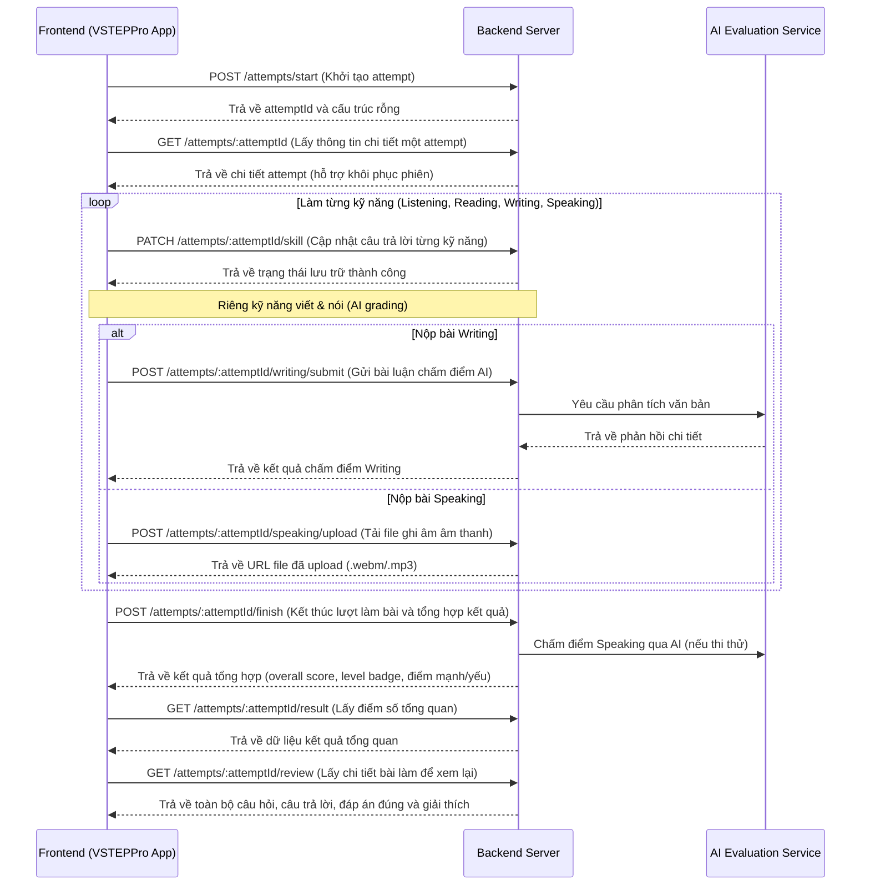

# API Contract - VSTEPPro Attempts Module

Tài liệu này định nghĩa thiết kế API Contract (hợp đồng API) giữa Frontend (FE) và Backend (BE) cho module quản lý lượt làm bài (Attempts), hỗ trợ cả hai chế độ **Luyện tập (Practice)** và **Thi thử (Mock Test)**.

---

## Danh sách các API Endpoints



---

## Chi tiết đặc tả API

### 1. Khởi tạo lượt làm bài mới
* **Method**: `POST`
* **URL**: `/api/v1/attempts/start`
* **Purpose**: Bắt đầu một lượt luyện tập hoặc thi thử mới, tạo bản ghi tương ứng trong cơ sở dữ liệu.
* **Role**: Phải xác thực người dùng (Bearer Token).
* **Request Body**:
  ```json
  {
    "mode": "mock_test" 
  }
  ```
  *(Các giá trị hợp lệ cho `mode`: `"practice"`, `"mock_test"`)*
* **Response Body (Success - 201 Created)**:
  ```json
  {
    "success": true,
    "data": {
      "id": "mock-17123456789",
      "mode": "mock_test",
      "startedAt": 1712345678900,
      "skills": {},
      "status": "in_progress"
    }
  }
  ```
* **Error Cases**:
  * `400 Bad Request`: Thiếu trường thông tin hoặc `mode` không hợp lệ.
  * `401 Unauthorized`: Token xác thực không hợp lệ hoặc đã hết hạn.
* **Màn hình FE sử dụng**: `/quiz` (khi nhấn bắt đầu Luyện tập kỹ năng hoặc Thi thử full test).

---

### 2. Lấy thông tin chi tiết một lượt làm bài
* **Method**: `GET`
* **URL**: `/api/v1/attempts/:attemptId`
* **Purpose**: Truy vấn thông tin chi tiết, trạng thái hiện tại của một lượt làm bài (bao gồm cả các kỹ năng đã lưu tiến trình) phục vụ việc khôi phục hoặc tiếp tục làm bài sau khi F5.
* **Role**: Phải xác thực người dùng.
* **Request Body**: Rỗng.
* **Response Body (Success - 200 OK)**:
  ```json
  {
    "success": true,
    "data": {
      "id": "mock-17123456789",
      "mode": "mock_test",
      "startedAt": 1712345678900,
      "finishedAt": null,
      "skills": {
        "listening": {
          "skill": "listening",
          "answers": {
            "1": 2,
            "2": 0,
            "3": 3
          },
          "score": 25,
          "totalQuestions": 35
        }
      },
      "status": "in_progress"
    }
  }
  ```
* **Error Cases**:
  * `404 Not Found`: Không tìm thấy `attemptId`.
  * `401 Unauthorized`: Token không hợp lệ.
* **Màn hình FE sử dụng**: Bất kỳ trang quiz làm bài nào (ListeningQuiz, ReadingQuiz, v.v.) lúc khởi tạo (useEffect) để kiểm tra trạng thái và khôi phục bài làm hiện tại.

---

### 3. Cập nhật tiến trình của một kỹ năng
* **Method**: `PATCH`
* **URL**: `/api/v1/attempts/:attemptId/skill`
* **Purpose**: Cập nhật câu trả lời hoặc trạng thái làm bài của một kỹ năng trong tiến trình thi thử hoặc luyện tập.
* **Role**: Phải xác thực người dùng.
* **Request Body**:
  ```json
  {
    "skill": "listening",
    "answers": {
      "1": 2,
      "2": 0,
      "3": 3
    },
    "score": 25,
    "totalQuestions": 35
  }
  ```
  *(Các giá trị hợp lệ cho `skill`: `"listening"`, `"reading"`, `"writing"`, `"speaking"`)*
* **Response Body (Success - 200 OK)**:
  ```json
  {
    "success": true,
    "data": {
      "id": "mock-17123456789",
      "skills": {
        "listening": {
          "skill": "listening",
          "answers": {
            "1": 2,
            "2": 0,
            "3": 3
          },
          "score": 25,
          "totalQuestions": 35
        }
      }
    }
  }
  ```
* **Error Cases**:
  * `404 Not Found`: Không tìm thấy `attemptId`.
  * `400 Bad Request`: Payload không đúng định dạng.
* **Màn hình FE sử dụng**: Màn hình nộp bài của ListeningQuiz, ReadingQuiz, WritingQuiz và SpeakingQuiz.

---

### 4. Tải lên file ghi âm Speaking
* **Method**: `POST`
* **URL**: `/api/v1/attempts/:attemptId/speaking/upload`
* **Purpose**: Tải lên tệp âm thanh ghi âm phần nói của học viên để lưu trữ vĩnh viễn trên Cloud Storage (S3, Firebase Storage, v.v.) thay vì sử dụng Blob URL tạm thời.
* **Role**: Phải xác thực người dùng, multipart/form-data.
* **Request Headers**: `Content-Type: multipart/form-data`
* **Request Body**:
  * `partId`: number (ví dụ: `1`, `2`, `3`)
  * `audio`: File (binary blob file)
* **Response Body (Success - 200 OK)**:
  ```json
  {
    "success": true,
    "data": {
      "attemptId": "mock-17123456789",
      "partId": 1,
      "audioUrl": "https://storage.vsteppro.edu.vn/attempts/mock-17123456789/speaking-part-1.webm"
    }
  }
  ```
* **Error Cases**:
  * `413 Payload Too Large`: Dung lượng tệp tin vượt quá giới hạn (ví dụ >10MB).
  * `415 Unsupported Media Type`: Định dạng tệp không được hỗ trợ (chỉ chấp nhận `.webm`, `.wav`, `.mp3`, `.m4a`).
* **Màn hình FE sử dụng**: `SpeakingQuiz.tsx` (ngay sau khi hoàn thành ghi âm một Part hoặc khi nhấn nộp bài).

---

### 5. Chấm điểm bài viết (Writing) qua AI
* **Method**: `POST`
* **URL**: `/api/v1/attempts/:attemptId/writing/submit`
* **Purpose**: Gửi các bài luận Writing lên Backend để kích hoạt chấm điểm tự động bằng LLM/AI.
* **Role**: Phải xác thực người dùng.
* **Request Body**:
  ```json
  {
    "writings": {
      "1": "Dear Sir/Madam, I am writing this letter to...",
      "2": "In recent years, technology has developed rapidly..."
    }
  }
  ```
* **Response Body (Success - 200 OK)**:
  ```json
  {
    "success": true,
    "data": {
      "writingFeedback": {
        "1": {
          "taskAchievement": "Đáp ứng tốt yêu cầu đề bài, trả lời đầy đủ các câu hỏi phụ.",
          "coherence": "Các ý kết nối mạch lạc, sử dụng tốt từ nối.",
          "lexical": "Vốn từ vựng tương đối đa dạng.",
          "grammar": "Không có lỗi sai ngữ pháp nghiêm trọng.",
          "score": "7.5",
          "tips": [
            "Nên sử dụng thêm cấu trúc đảo ngữ.",
            "Thay thế từ 'good' bằng 'beneficial' để tăng điểm từ vựng."
          ],
          "errors": [
            {
              "word": "writting",
              "type": "spelling",
              "suggestion": "writing",
              "explanation": "Viết sai chính tả từ 'writing'."
            }
          ]
        }
      }
    }
  }
  ```
* **Error Cases**:
  * `502 Bad Gateway`: Lỗi kết nối dịch vụ AI grading.
* **Màn hình FE sử dụng**: `WritingQuiz.tsx` (sau khi người dùng nhấn nộp bài).

---

### 6. Kết thúc lượt làm bài (Tổng hợp điểm)
* **Method**: `POST`
* **URL**: `/api/v1/attempts/:attemptId/finish`
* **Purpose**: Đánh dấu hoàn thành bài thi thử full-test hoặc bài luyện tập, tổng hợp điểm số 4 kỹ năng, quy đổi band VSTEP, tự động phân tích điểm mạnh/yếu và gợi ý luyện tập.
* **Role**: Phải xác thực người dùng.
* **Request Body**: Rỗng `{}` hoặc thông tin bổ sung nếu có.
* **Response Body (Success - 200 OK)**:
  ```json
  {
    "success": true,
    "data": {
      "id": "mock-17123456789",
      "mode": "mock_test",
      "startedAt": 1712345678900,
      "finishedAt": 1712345679900,
      "overallScore": 6.5,
      "level": "B2",
      "strengths": [
        "Bạn có khả năng nghe hiểu tốt, nhận biết được các từ khóa và ý chính trong hội thoại và bài giảng.",
        "Khả năng diễn đạt nói khá tự nhiên, phát âm rõ và độ trôi chảy tốt."
      ],
      "weaknesses": [
        "Cần cải thiện khả năng đọc hiểu chi tiết và suy luận thông tin.",
        "Cần cải thiện cấu trúc ngữ pháp và vốn từ vựng học thuật."
      ],
      "recommendedPractice": [
        "Luyện thêm dạng câu hỏi suy luận (inference) trong Reading.",
        "Viết lại Task 2 với outline rõ ràng hơn và sử dụng nhiều từ nối đa dạng."
      ]
    }
  }
  ```
* **Màn hình FE sử dụng**: Được gọi ở phần kết thúc của `SpeakingQuiz.tsx` (khi hoàn thành kỹ năng cuối cùng trong Mock Test) hoặc khi nộp bài luyện tập đơn lẻ.

---

### 7. Lấy kết quả điểm số tổng quan (Result)
* **Method**: `GET`
* **URL**: `/api/v1/attempts/:attemptId/result`
* **Purpose**: Truy vấn điểm số tổng quan của một lượt làm bài đã hoàn thành để hiển thị trên màn hình báo cáo kết quả.
* **Role**: Phải xác thực người dùng.
* **Response Body (Success - 200 OK)**:
  ```json
  {
    "success": true,
    "data": {
      "id": "mock-17123456789",
      "mode": "mock_test",
      "finishedAt": 1712345679900,
      "overallScore": 6.5,
      "level": "B2",
      "skills": {
        "listening": { "score": 25, "totalQuestions": 35 },
        "reading": { "score": 28, "totalQuestions": 40 },
        "writing": { "score": 7.0 },
        "speaking": { "score": 6.5 }
      },
      "strengths": [
        "Bạn có khả năng nghe hiểu tốt, nhận biết được các từ khóa và ý chính trong hội thoại và bài giảng."
      ],
      "weaknesses": [
        "Cần cải thiện khả năng đọc hiểu chi tiết và suy luận thông tin."
      ],
      "recommendedPractice": [
        "Luyện thêm dạng câu hỏi suy luận (inference) trong Reading."
      ]
    }
  }
  ```
* **Màn hình FE sử dụng**: `/attempts/:attemptId/result` (Trang `AttemptResult.tsx`).

---

### 8. Lấy dữ liệu xem lại chi tiết (Review)
* **Method**: `GET`
* **URL**: `/api/v1/attempts/:attemptId/review`
* **Purpose**: Truy vấn toàn bộ chi tiết bài làm bao gồm: danh sách đáp án người dùng đã chọn, danh sách đáp án đúng, giải thích câu hỏi và bản ghi âm bài nói, bài luận viết.
* **Role**: Phải xác thực người dùng.
* **Response Body (Success - 200 OK)**:
  ```json
  {
    "success": true,
    "data": {
      "id": "mock-17123456789",
      "mode": "mock_test",
      "skills": {
        "listening": {
          "skill": "listening",
          "answers": { "1": 2, "2": 0 },
          "score": 25,
          "totalQuestions": 35,
          "audioUrl": "https://storage.vsteppro.edu.vn/exams/mock-listening-full.mp3"
        },
        "reading": {
          "skill": "reading",
          "answers": { "1": 3, "2": 1 },
          "score": 28,
          "totalQuestions": 40
        },
        "writing": {
          "skill": "writing",
          "writings": {
            "1": "Dear Sir/Madam, I write this letter to..."
          },
          "writingFeedback": {
            "1": {
              "score": "7.0",
              "taskAchievement": "...",
              "errors": []
            }
          }
        },
        "speaking": {
          "skill": "speaking",
          "recordings": {
            "1": "https://storage.vsteppro.edu.vn/attempts/mock-17123456789/speaking-part-1.webm"
          },
          "speakingFeedback": {
            "1": {
              "pronunciation": "Phát âm rõ ràng...",
              "fluency": "Tốt...",
              "grammar": "Khá...",
              "vocabulary": "Ổn...",
              "transcript": "Well, in my free time, I like to read books...",
              "tips": []
            }
          }
        }
      }
    }
  }
  ```
* **Màn hình FE sử dụng**: `/attempts/:attemptId/review` (Trang `AttemptReview.tsx`).
